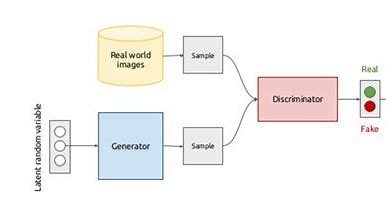
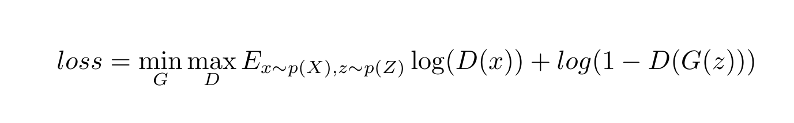

# 深度学习中的生成模型
## 一、介绍
在聚类(clustering)、动态模型(Dynamic Model)中介绍了统计学习中生成式模型和判别式模型的区别。简单来说，判别式模型(Discriminant Model)是对输出变量Y关于输入变量X的条件概率P(Y|X)进行建模，
深度学习中的分类、回归问题都属于判别式模型。而产生式模型(generative model)是对数据的产生过程(输入变量Z和输出变量X联合分布P(X, Z))进行建模。

在GMM聚类中，最终任务是求隐变量Z(类别)关于观测数据X的条件概率P(Z|X)，它是一个推断(inference)问题;还有比如动态模型中，最终的任务也是要对隐变量(系统状态Z)进行推断。
但今天介绍深度学习中生成式模型的任务并非如此，它的目的是求P(X')=ΣP(Z)P(X’|Z)，即用**隐变量生成假数据X'**，用在生成假的图像、声音等地方，这是非常非常不一样的地方。
这里主要介绍变分自编码器和GAN两种深度学习中的生成式模型。

## 二、GAN
生成对抗网络(generative adversarial network, GAN)的模型结构如下图所示：

GAN由生成器(generator)和判别器(discriminator)组成，其中生成器是一个带参数映射G：Z-->X'，把隐变量Z映射到X'。隐变量Z采样自一个已知分布，比如高斯分布。生成器可以隐式地求
P(X') = P(G(Z))=ΣP(Z)P(X'|Z)。而真实数据变量为X，来自分布P(X)，GAN就是让P(X')和P(X)尽可能地接近。两个分布的“距离”可以用交叉熵、KL散度，但在GAN中并没有关于分布的解析形式，
只有从P(X')和P(X)中采样的数据，GAN的思路是既然没有合适的描述分布差距的度量，干脆用**神经网络训练出这个度量**。

具体来说，GAN通过一个判别器D(二分类器)，D的任务是把真实数据x分类为1(正例)，把生成的伪数据x‘分类为0(负例)。GAN的期望损失函数为：

该损失函数解释为：对D来说，x的标签是1，log(D(X))即为负的交叉熵，对D来说应该最大化。而G(z)对D来说标签为0，则log(1-D(G(z)))即为负的交叉熵，关于D要最大化；
而对G而言需要**尽量骗过D**，因此它要最小化该项。在训练过程中，D和G在一次迭代(iteration)中分别进行参数更新。

## 三、VAE
变分自编码器(variational autoencoder, VAE)