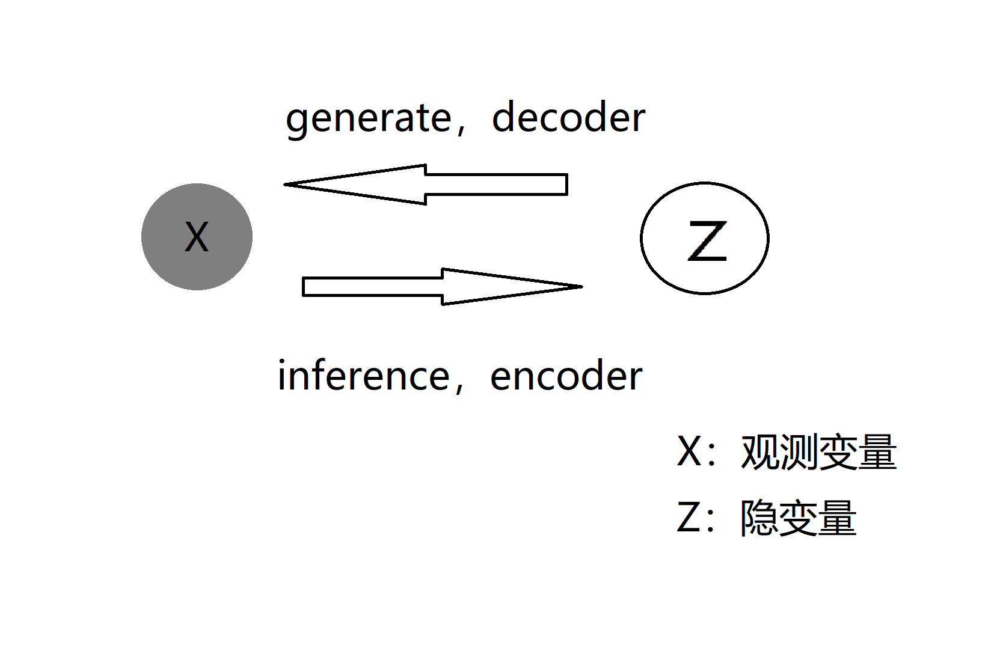
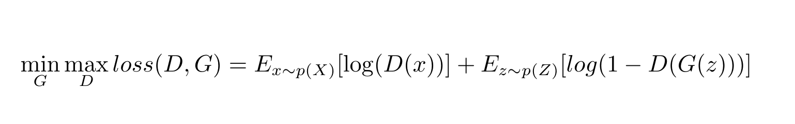

# 深度学习中的生成模型
## 一、介绍
在聚类(clustering)、动态模型(Dynamic Model)中介绍了生成式模型和判别式模型的区别。简单来说，判别式模型(Discriminant Model)是对输出变量Y关于输入变量X的条件概率P(Y|X)进行建模，
深度学习中的分类、回归问题都属于判别式模型。而产生式模型(generative model)是对数据的产生过程(输入变量Z和输出变量X联合分布P(X, Z))进行建模。

在GMM聚类中，最终任务是求隐变量Z(类别)关于观测数据X的条件概率P(Z|X)，它是一个推断(inference)问题;还有比如动态模型中，最终的任务也是要对隐变量(系统状态Z)进行推断。
但今天介绍深度学习中生成式模型的任务并非如此，它的目的是求P(X')=ΣP(Z)P(X’|Z)，是一个生成问题，即用**隐变量生成假数据X'**。

这里介绍VAE和GAN两种深度学习中的生成式模型。

## 二、GAN
生成对抗网络(generative adversarial network, GAN)的模型结构如下图所示：

GAN由生成器(generator)和判别器(discriminator)组成，其中生成器是一个带参数映射G：Z-->X'，把隐变量Z映射到X'。隐变量Z采样自一个已知分布，比如高斯分布。生成器可以隐式地求
P(X') = P(G(Z))=ΣP(Z)P(X'|Z)。而真实数据变量为X，来自分布P(X)，GAN就是让P(X')和P(X)尽可能地接近。两个分布的“距离”可以用交叉熵、KL散度，但在GAN中并没有关于分布的解析形式，
只有从P(X')和P(X)中采样的数据，GAN的思路是既然没有合适的描述分布差距的度量，干脆用**神经网络训练出这个度量**。

具体来说，GAN通过一个判别器D(二分类器)，D的任务是把真实数据x分类为1(正例)，把生成的伪数据x‘分类为0(负例)。GAN的期望损失函数为：

该损失函数解释为：对D来说，x的标签是1，log(D(X))即为负的交叉熵，对D来说应该最大化。而G(z)对D来说标签为0，则log(1-D(G(z)))即为负的交叉熵，关于D要最大化；
而对G而言需要**尽量骗过D**，因此它要最小化该项。在训练过程中，D和G在一次迭代(iteration)中分别进行参数更新。优化的结果是判别器D无法判别数据来自X还是G(Z)，
也就是分布P(X') = P(G(Z))与分布P(X)近似相等。

## 三、VAE
变分自编码器(Variational Autoencoder, VAE)模型源于自编码器(Autoencoder, AE)，自编码器由编码器(encoder)和解码器(decoder)组成，编码器将输入X映射到隐变量Z，解码器将隐变量Z映射到X'。损失函数一般为MSE，让输入X与解码X'尽量相等。

在一般应用中，自编码器一般用编码器，作为输入高维数据的一个低维空间嵌入(embedding)。但在生成式模型中，使用的部分是解码器(decoder)，即将隐变量Z映射到X'的部分。需要注意的是，这里不能直接使用自编码器的解码器作为一个生成模型，
原因在于如果抛离编码器，隐变量Z的分布P(Z)=ΣP(X)P(Z|X)我们是一无所知的，无法从中采样作为解码器的输入。而VAE的想法是在AE的基础上，对隐变量Z的分布进行一定的约束(正则化)。比如约束P(Z|X)=N(Z|0, I)，则P(Z) = ΣP(X)P(Z|X) = N(Z|0, I)，
这样即便抛离编码器，也可以从N(0, I)中采样作为解码器(生成模型)的输入。

VAE使用了重参数化技巧(Reparameterization)，即编码器不输出隐变量Z，而输出Z服从的分布的参数。比如编码器输出高斯分布参数μ、Σ，接着可以用它和标准正态分布的KL散度作为损失函数对Z的分布进行约束，这里给出一元高斯分布的示例，多元高斯分布有相同形式：

解码器的输入来自N(Z|μ、Σ)采样，具体做法是先生成一个服从标准正态分布的张量*η*，令Σ*η*+μ作为解码器的输入，这样能对**参数μ、Σ进行梯度反向传播计算**。
最终损失函数的形式为： 

Loss = LossMSE + λ * LossKL

其中λ是一个超参数，调节着重构误差LossMSE和规范误差LossKL的权重占比。这是和GAN不一样的地方，GAN是分成两部分对抗(交替优化)，而VAE则是两部分损失的trade-off。
VAE一个常见的解释是：在AE的基础上，关于方差的编码器实际上是给均值的编码器加上了高斯噪声，使得解码器对于噪声具有一定的稳健性，使得隐空间更多的点是有意义的，这是VAE对AE改进和提升的地方。

## 五、总结

1. GAN和VAE都假设隐变量Z服从已知分布，希望训练得到一个模型X'=G(Z)，使得在该分布变换下X'分布和真实数据X分布尽量接近。
2. 生成模型的难点在于生成数据和真实分布之间的度量，GAN是通过判别器学习一个度量，而VAE则通过AE的MSE来构造度量。
3. VAE中变分体现在对KL散度的优化上，KL散度可以看作关于两个分布的泛函，求极值即变分。
4. 虽然GAN和VAE都是逼近数据的分布，但从它们的训练过程可以看出，GAN构造的是Z和X之间**非一一对应的映射关系**，而VAE用AE结构，Z和X是有**一一对应关系**的。

[1] [https://zhuanlan.zhihu.com/p/34998569](https://zhuanlan.zhihu.com/p/34998569)